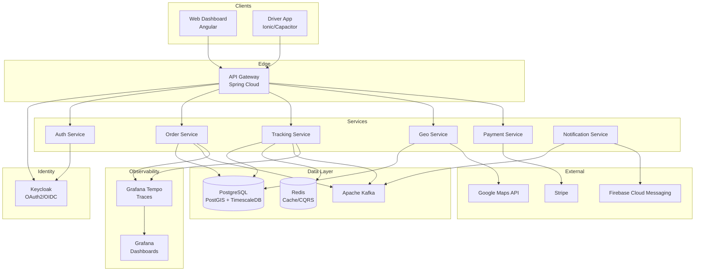

# System Architecture Diagram

```mermaid
graph TB
    subgraph "Clients"
        WebApp[Web Dashboard<br/>Angular]
        MobileApp[Driver App<br/>Ionic/Capacitor]
    end

    subgraph "Edge"
        Gateway[API Gateway<br/>Spring Cloud]
    end

    subgraph "Identity"
        Keycloak[Keycloak<br/>OAuth2/OIDC]
    end

    subgraph "Services"
        AuthSvc[Auth Service]
        OrderSvc[Order Service]
        TrackingSvc[Tracking Service]
        GeoSvc[Geo Service]
        PaymentSvc[Payment Service]
        NotifSvc[Notification Service]
    end

    subgraph "Data Layer"
        Postgres[(PostgreSQL<br/>PostGIS + TimescaleDB)]
        Redis[(Redis<br/>Cache/CQRS)]
        Kafka[Apache Kafka]
    end

    subgraph "External"
        GoogleMaps[Google Maps API]
        Stripe[Stripe]
        FCM[Firebase Cloud Messaging]
    end

    subgraph "Observability"
        Tempo[Grafana Tempo<br/>Traces]
        Grafana[Grafana<br/>Dashboards]
    end

    WebApp --> Gateway
    MobileApp --> Gateway
    Gateway --> Keycloak
    Gateway --> AuthSvc
    Gateway --> OrderSvc
    Gateway --> TrackingSvc
    Gateway --> GeoSvc
    Gateway --> PaymentSvc

    AuthSvc --> Keycloak
    OrderSvc --> Postgres
    OrderSvc --> Kafka
    TrackingSvc --> Postgres
    TrackingSvc --> Redis
    TrackingSvc --> Kafka
    GeoSvc --> Postgres
    GeoSvc --> GoogleMaps
    PaymentSvc --> Stripe
    NotifSvc --> Kafka
    NotifSvc --> FCM

    TrackingSvc --> Tempo
    OrderSvc --> Tempo
    Tempo --> Grafana
```
