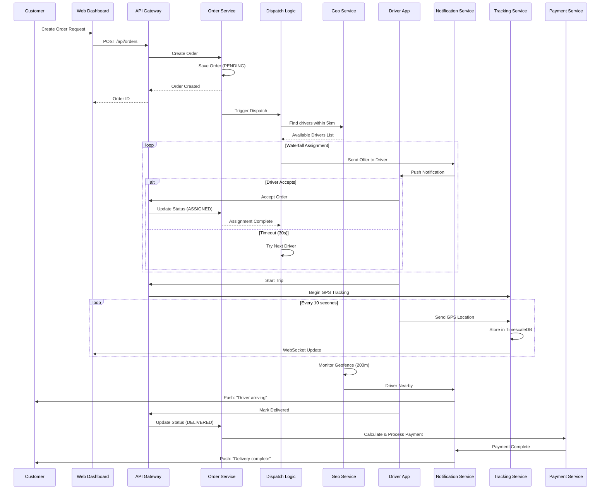

# Order Flow Sequence Diagram

```mermaid
sequenceDiagram
    participant Customer
    participant Dashboard as Web Dashboard
    participant Gateway as API Gateway
    participant Order as Order Service
    participant Dispatch as Dispatch Logic
    participant Geo as Geo Service
    participant Driver as Driver App
    participant Notif as Notification Service
    participant Tracking as Tracking Service
    participant Payment as Payment Service

    Customer->>Dashboard: Create Order Request
    Dashboard->>Gateway: POST /api/orders
    Gateway->>Order: Create Order
    Order->>Order: Save Order (PENDING)
    Order-->>Gateway: Order Created
    Gateway-->>Dashboard: Order ID

    Order->>Dispatch: Trigger Dispatch
    Dispatch->>Geo: Find drivers within 5km
    Geo-->>Dispatch: Available Drivers List
    
    loop Waterfall Assignment
        Dispatch->>Notif: Send Offer to Driver
        Notif->>Driver: Push Notification
        alt Driver Accepts
            Driver->>Gateway: Accept Order
            Gateway->>Order: Update Status (ASSIGNED)
            Order-->>Dispatch: Assignment Complete
        else Timeout (30s)
            Dispatch->>Dispatch: Try Next Driver
        end
    end

    Driver->>Gateway: Start Trip
    Gateway->>Tracking: Begin GPS Tracking
    
    loop Every 10 seconds
        Driver->>Tracking: Send GPS Location
        Tracking->>Tracking: Store in TimescaleDB
        Tracking->>Dashboard: WebSocket Update
    end

    Geo->>Geo: Monitor Geofence (200m)
    Geo->>Notif: Driver Nearby
    Notif->>Customer: Push: "Driver arriving"

    Driver->>Gateway: Mark Delivered
    Gateway->>Order: Update Status (DELIVERED)
    Order->>Payment: Calculate & Process Payment
    Payment->>Notif: Payment Complete
    Notif->>Customer: Push: "Delivery complete"
```
