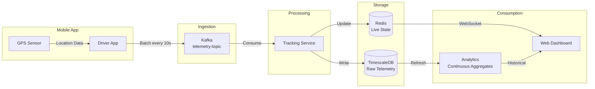
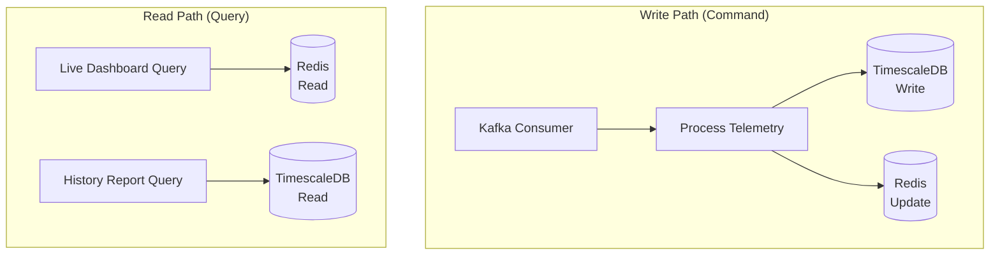

# Data Flow Diagram

```mermaid
flowchart LR
    subgraph "Mobile App"
        GPS[GPS Sensor]
        App[Driver App]
    end

    subgraph "Ingestion"
        Kafka[Kafka<br/>telemetry-topic]
    end

    subgraph "Processing"
        Tracking[Tracking Service]
    end

    subgraph "Storage"
        TimescaleDB[(TimescaleDB<br/>Raw Telemetry)]
        Redis[(Redis<br/>Live State)]
    end

    subgraph "Consumption"
        Dashboard[Web Dashboard]
        Analytics[Analytics<br/>Continuous Aggregates]
    end

    GPS -->|Location Data| App
    App -->|Batch every 10s| Kafka
    Kafka -->|Consume| Tracking
    Tracking -->|Write| TimescaleDB
    Tracking -->|Update| Redis
    Redis -->|WebSocket| Dashboard
    TimescaleDB -->|Refresh| Analytics
    Analytics -->|Historical| Dashboard
```

# CQRS Pattern Detail

```mermaid
flowchart TB
    subgraph "Write Path (Command)"
        KafkaIn[Kafka Consumer]
        WriteLogic[Process Telemetry]
        TSWrite[(TimescaleDB<br/>Write)]
        RedisWrite[(Redis<br/>Update)]
    end

    subgraph "Read Path (Query)"
        LiveQuery[Live Dashboard Query]
        RedisRead[(Redis<br/>Read)]
        HistoryQuery[History Report Query]
        TSRead[(TimescaleDB<br/>Read)]
    end

    KafkaIn --> WriteLogic
    WriteLogic --> TSWrite
    WriteLogic --> RedisWrite

    LiveQuery --> RedisRead
    HistoryQuery --> TSRead
```
