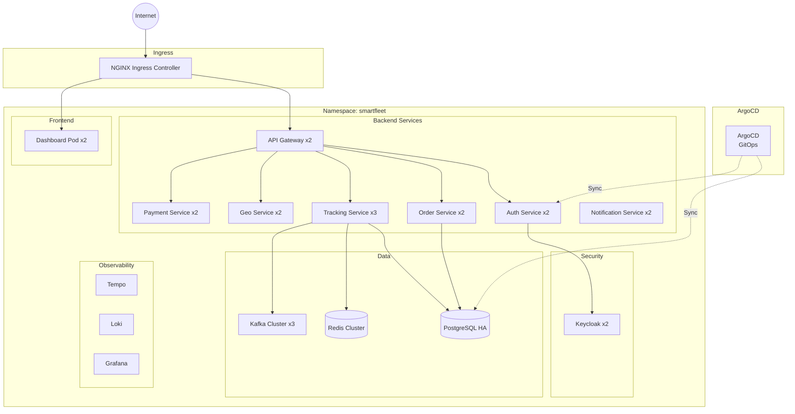

# Deployment Architecture (Kubernetes)

```mermaid
graph TB
    subgraph "Ingress"
        Nginx[NGINX Ingress Controller]
    end

    subgraph "ArgoCD"
        Argo[ArgoCD<br/>GitOps]
    end

    subgraph "Namespace: smartfleet"
        subgraph "Frontend"
            DashboardPod[Dashboard Pod x2]
        end

        subgraph "Backend Services"
            AuthPod[Auth Service x2]
            OrderPod[Order Service x2]
            TrackingPod[Tracking Service x3]
            GeoPod[Geo Service x2]
            PaymentPod[Payment Service x2]
            NotifPod[Notification Service x2]
            GatewayPod[API Gateway x2]
        end

        subgraph "Data"
            PostgresPod[(PostgreSQL HA)]
            RedisPod[(Redis Cluster)]
            KafkaPod[Kafka Cluster x3]
        end

        subgraph "Security"
            KeycloakPod[Keycloak x2]
        end

        subgraph "Observability"
            TempoPod[Tempo]
            LokiPod[Loki]
            GrafanaPod[Grafana]
        end
    end

    Internet((Internet)) --> Nginx
    Nginx --> GatewayPod
    GatewayPod --> AuthPod
    GatewayPod --> OrderPod
    GatewayPod --> TrackingPod
    GatewayPod --> GeoPod
    GatewayPod --> PaymentPod
    Nginx --> DashboardPod

    OrderPod --> PostgresPod
    TrackingPod --> PostgresPod
    TrackingPod --> RedisPod
    TrackingPod --> KafkaPod
    AuthPod --> KeycloakPod

    Argo -.->|Sync| PostgresPod
    Argo -.->|Sync| AuthPod
```
